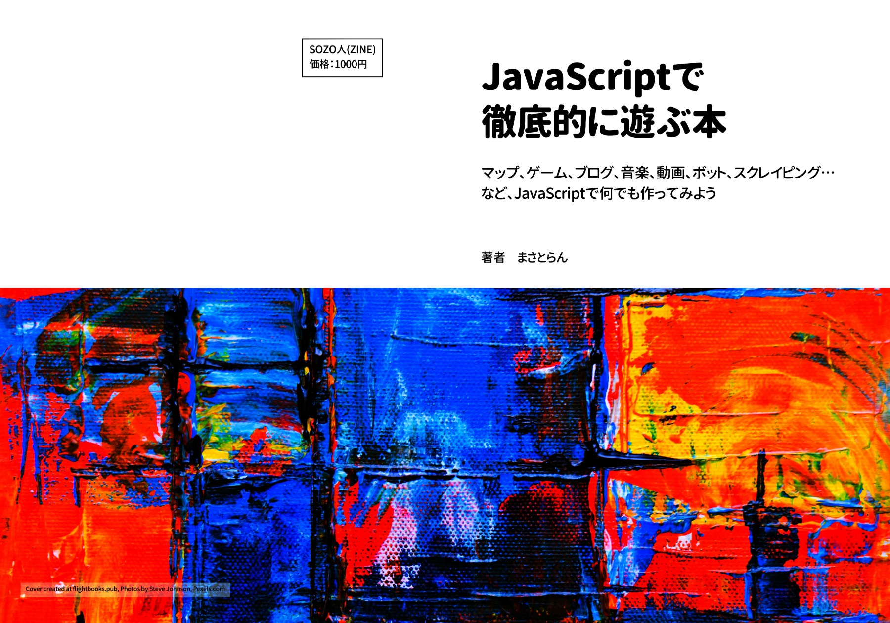

# JavaScriptで徹底的に遊ぶ本 ＜サポートサイト＞

## 本書について

- JavaScriptの基本的な学習を終了した人
- 初心者から中級者にステップアップしたい人
- JavaScriptでいろんなWebアプリを作ってみたい人
- とにかくJavaScriptが好きな人

本書は上記のような人にオススメできる「作って勉強する」スタイルの本になります。
とにかくJavaScriptの勉強と言えば、フレームワーク論争やWebpack・BabelなどのNode.js開発環境の話になりがちなのですが、そうではなくて純粋にJavaScriptを使って「何かを作る」ということに重点を置いた本です。

本書を読むことで、ブックマークレット、3Dゲーム、音楽、ブログ、チャットボット…など、さまざまなジャンルのWebアプリをライブラリやWebサービスなどを駆使して誰でも開発できるようになります。

★販売ページ：https://masatolan.booth.pm/items/1311268

## サポートサイトについて

本書に掲載しているサンプルコードやダウンロードファイルなどをすべてまとめています。

ソースコードは独自プロジェクト、勉強会などなど…自由にご利用頂いて問題ありません。

## 補足・注意事項

- 第2章のブックマークレットについてはWindowsのChromeブラウザで行った場合、本書の表示と異なる場合があるのでその際はブックマークマネージャを利用してコードを作成・利用するようにお願い致します。
- PDFからURLやコードなどをコピペした場合、本書のフォーマット仕様の関係で間にスペースが入ることがあるのでご注意ください。
