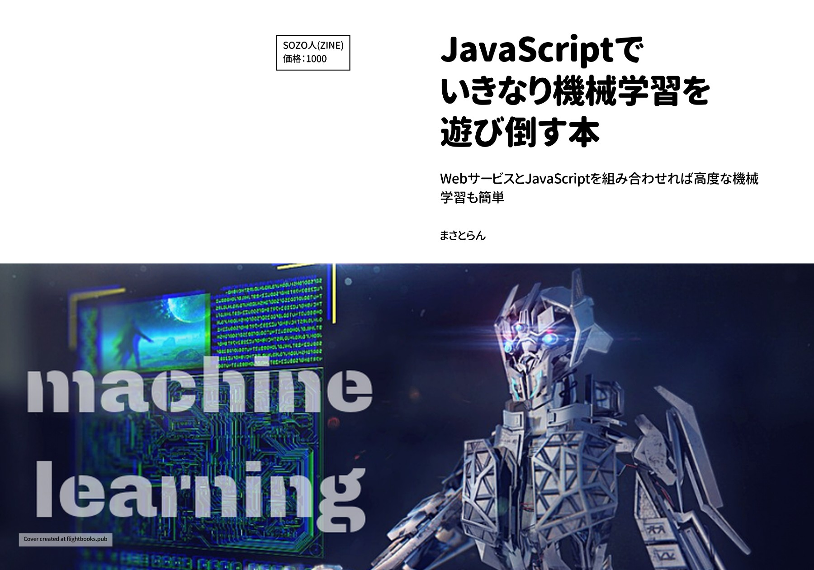

# JavaScriptでいきなり機械学習を遊び倒す本 ＜サポートサイト＞

## 本書について

「機械学習って難しいんでしょ…？」

そういう人にこそ読んで欲しい、誰でも手軽に機械学習のエッセンスを組み込んだWebアプリを構築できるようになる初心者向けのチュートリアル本です。

高度な機械学習を簡単にするWebサービスを組み合わせれば基本的なJavaScriptだけで…

- 画像に写っているモノを認識させる
- 表情を分析して喜怒哀楽を把握する
- 顔認識をさせてみる
- 年齢、性別、人種など自動判別する
- 写真の優劣をスコアで判定する

…などなど、いろんなことが出来るようになります！

また、独自の学習モデルを構築することで自分だけのAIも作れるようになります。
本書では、JavaScriptだけでも十分に機械学習を扱える便利なWebサービスを組み合わせて、さまざまな実験ができるように構成しております。

これまで、興味はあるけど手が出せなかった人や機械学習を活用してみたいと考えている人、JavaScriptでミニアプリが作りたい人など、幅広く活用できる書籍となっています。

★販売ページ：https://masatolan.booth.pm/items/1578131

## サポートサイトについて

本書に掲載しているサンプルコードやダウンロードファイルなどをすべてまとめています。

ソースコードは独自プロジェクト、勉強会などなど…自由にご利用頂いて問題ありません。

## 補足・注意事項

・Chapter2の本書でご紹介している画面レイアウトがリニューアルにより変化しております。詳細は[該当の章](https://github.com/webhacck/techbooks/tree/master/machine-learning-with-javascript/Chapter2)で解説しておりますのでご確認をよろしくお願い致します。
